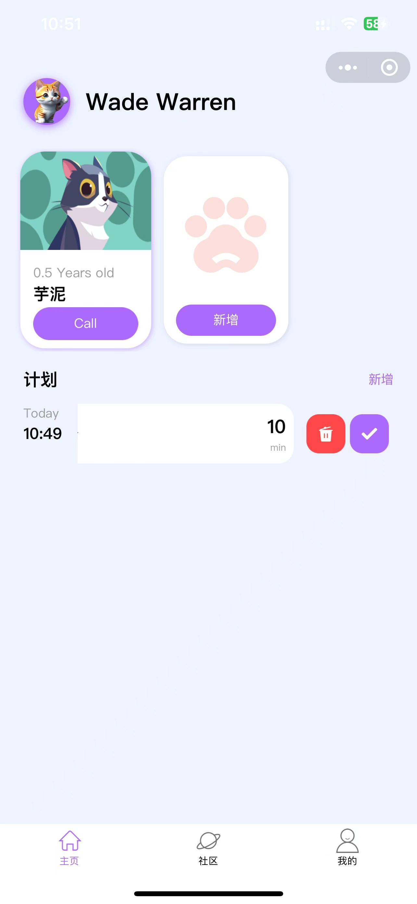

# 猫狗日记

基于 Vue3 + TS + UniApp + Vite4 开发的宠物日常管理小程序。

界面参考了一些 app，组件采用原生实现，不依赖第三方组件库。

API 采用 `Apifox` 提供的接口服务。

## 本地安装

```
git clone https://github.com/chenqifeng66/Cat-and-Dog-Diary.git
cd Cat-and-Dog-Diary
pnpm install
pnpm dev:h5
```

## 功能介绍

- 社区：在社区分享宠物的日常，让其他人也看到您与爱物的快乐时光。
- 待办事项：记录爱宠的代办事项，让你不再忘记爱宠的所有事情。
- 体重曲线：简洁清晰地了解爱宠的体重变化。

## UI


